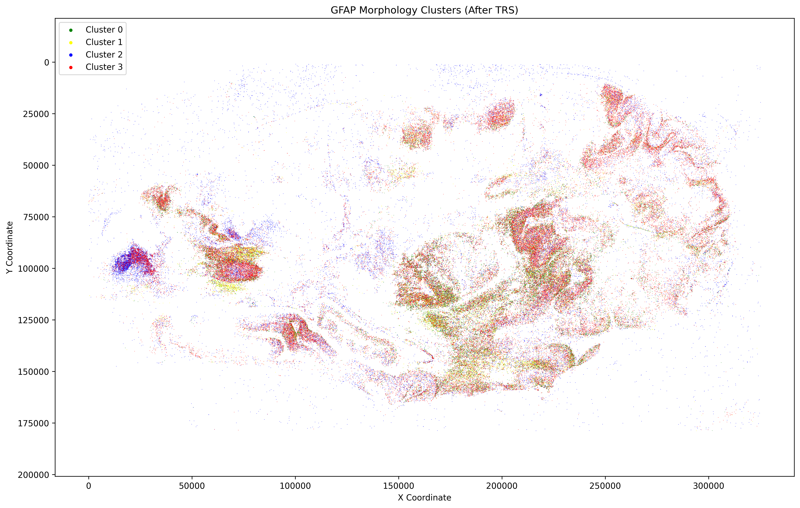

# Unsupervised Cell Phenotyping and Spatial Mapping at Scale

  
  
  
  

> A label-free pipeline that discovers distinct cell phenotypes from raw detections and maps every cell back onto the tissue, producing an interpretable spatial atlas instead of an unlabeled pile of crops. Built on large-scale human tissue imaging at the Sudha Gopalakrishnan Brain Centre, IIT Madras. This repository documents the method and results; source is held under institutional IP.

## What this is in one line

Given hundreds of thousands of cells with no labels, it discovers the distinct morphology types automatically and places every cell back on the tissue at its true coordinate.

## Why an R&D or health-tech team should care

- **Zero manual labels.** Phenotyping is normally the cost bottleneck. This learns the cell types directly from shape, so it scales to a new dataset with no re-annotation. That is the difference between a one-off study and a reusable pipeline.
- **It produces a product, not a plot.** The output is a spatial atlas where each cell carries a learned phenotype and a tissue coordinate, which is the substrate for biomarkers, region association, and population-scale analysis.
- **Interpretable by construction.** Cells are described by human-readable shape descriptors, so a reviewer can see why a cell joined a cluster.
- **Validated by the data itself.** The learned clusters are spatially organized rather than random noise, which is strong evidence the signatures capture real structure.

## Spatial phenotype atlas

Every detected cell plotted at its true tissue coordinate (section spanning about 320,000 by 200,000 px), colored by its learned cluster. The clusters form coherent spatial structures that track tissue architecture, so the unsupervised signatures line up with real anatomy.

## How it works

1. Cell crops come from the detection and segmentation stage ([sibling project](https://github.com/roshankumarvam-create/self-supervised-cell-segmentation)).
2. Each cell is reduced to interpretable shape descriptors: soma area, branch count, total process length, branching complexity, convex-hull ratios, symmetry.
3. Features are projected with UMAP to expose structure in low dimensions.
4. Unsupervised clustering groups cells into phenotypes with no labels supplied.
5. Each cell's cluster is written back to its tissue coordinate to build the whole-section atlas above.

## Results

Four distinct morphology clusters were recovered fully unsupervised, with clear spatial coherence across the section. They correspond to recognizable, interpretable shape families:

| Phenotype | Character |
|---|---|
| Stellate | star-shaped, many fine processes |
| Bipolar (simple) | elongated, two dominant processes |
| Bushy (complex) | dense, highly branched |
| Reactive (hypertrophic) | enlarged soma, thickened processes |

Per-cluster cell counts to be finalized.

## Tech stack

`scikit-image`, `NumPy / pandas`, `UMAP`, `scikit-learn`, `matplotlib`

## Why it matters

This is the representation-learning and analytics layer of an end to end cell-analysis program. It converts raw model outputs into a structured, spatial, label-free phenotype map that other systems can build on. The same pattern of detect, describe, cluster, map generalizes to any tissue and any cell type, which is what makes it a reusable platform rather than a single experiment.

Code is private under institutional agreements.
